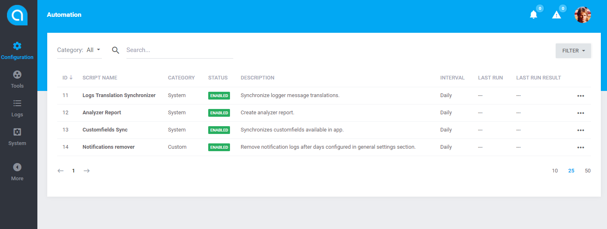

# Antares Automation Module

Automation is a module used to executte cyclic operations based on [laravel task scheduler](https://laravel.com/docs/5.4/scheduling). 
It serves as a replacement for setting up your own cron jobs to make it easier to manage. 
It provides an intuitive control  interface on the admin level. 
Automation can run tasks every few minutes, hourly, daily or weekly - depending how you set it up. 
Scheduled data is stored in the system database.

## Documentation

Antares Automation Module documentation can be found at [antaresproject.io/docs/core_modules/automation](http://antaresproject.io/docs/site/core_modules/automation/).

Full Antares documentation can be found at [antaresproject.io/docs](http://antaresproject.io/docs).

## Changelog

Antares Automation Module changelog can be found in release notes [antaresproject.io/docs/site/getting_started/changelog#automation](http://antaresproject.io/docs/site/getting_started/changelog/index.html#automation).

You can find full Antares changelog in Antares Documentation [antaresproject.io/docs/site/getting_started/changelog](http://antaresproject.io/docs/site/getting_started/changelog/index.html).

## Issues

The issue list of this repo is **exclusively** for bug reports and feature requests.

Please follow [Issue Reporting Guide](http://antaresproject.io/docs/site/getting_started/issues_reporting_guide/index.html) before opening an issue. Issues not following the guide will be closed without further investigation.

## Contribution

Please follow [Contribution Guide](http://antaresproject.io/docs/site/getting_started/contributing/index.html) before making a pull request.

## Community

* Twitter: @antaresproject
* Forum: (coming soon)
* Blog: (coming soon)
* Email: contact (at) antaresproject.io

## License

This software is released under the BSD 3-Clause License.

© 2017 INBS.Software , all rights reserved.
